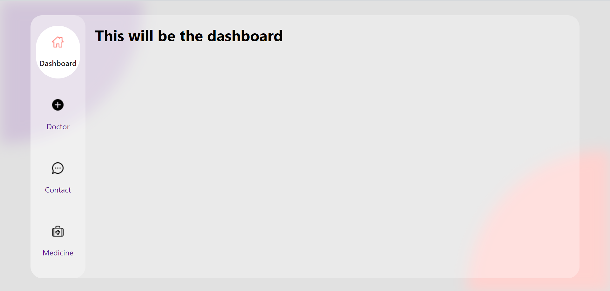
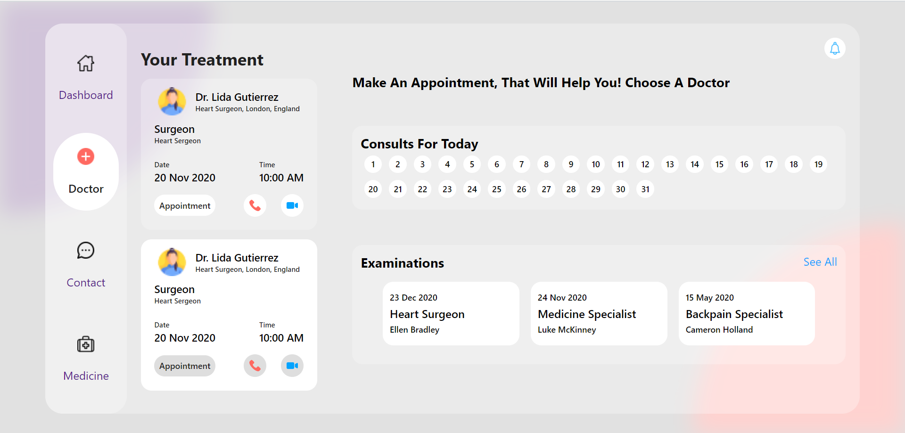
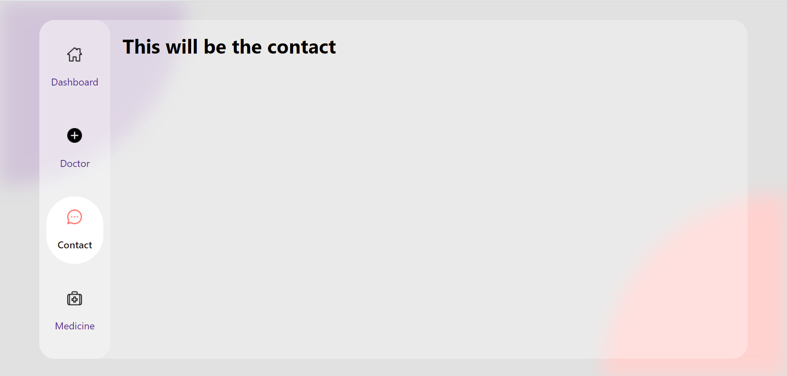
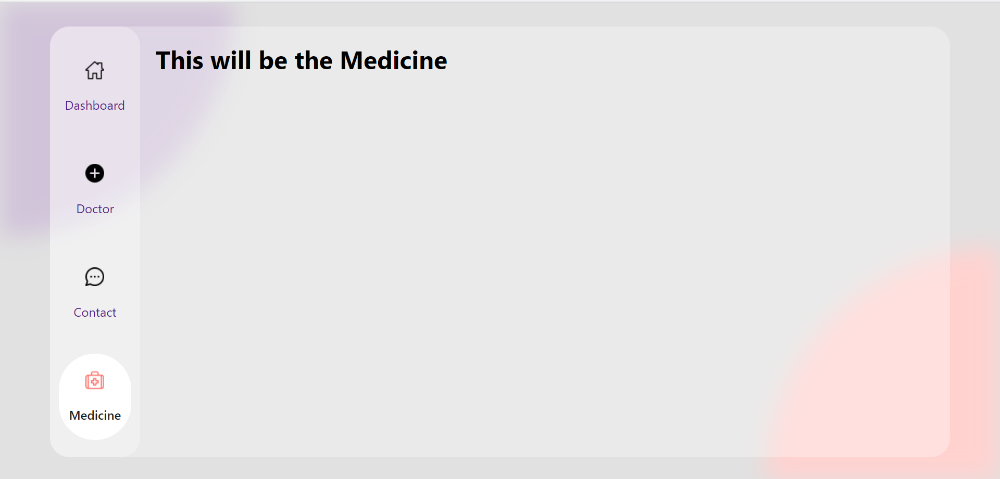

# Frontend Assignment

## Table of contents

- [Overview](#overview)
  - [Users should be able to](#Users-should-be-able-to:)
  - [Screenshot](#screenshot)
- [My process](#my-process)
  - [Built with](#built-with)
- [Author](#author)

## Overview

### Users should be able to:

- Navigate through different pages

### Screenshot

## My Process

### Built with

- Semantic HTML5 markup
- CSS custom properties
- Flexbox
- ReactJS

## Author

- Frontend Mentor - [@Gauravtripathii](https://www.frontendmentor.io/profile/Gauravtripathii)
- Instagram - [@gauravtripathii](https://www.instagram.com/gauravtripathii/)
- LinkedInn - [Gaurav Kumar Tripathi](https://www.linkedin.com/in/gaurav-kumar-tripathii/)
